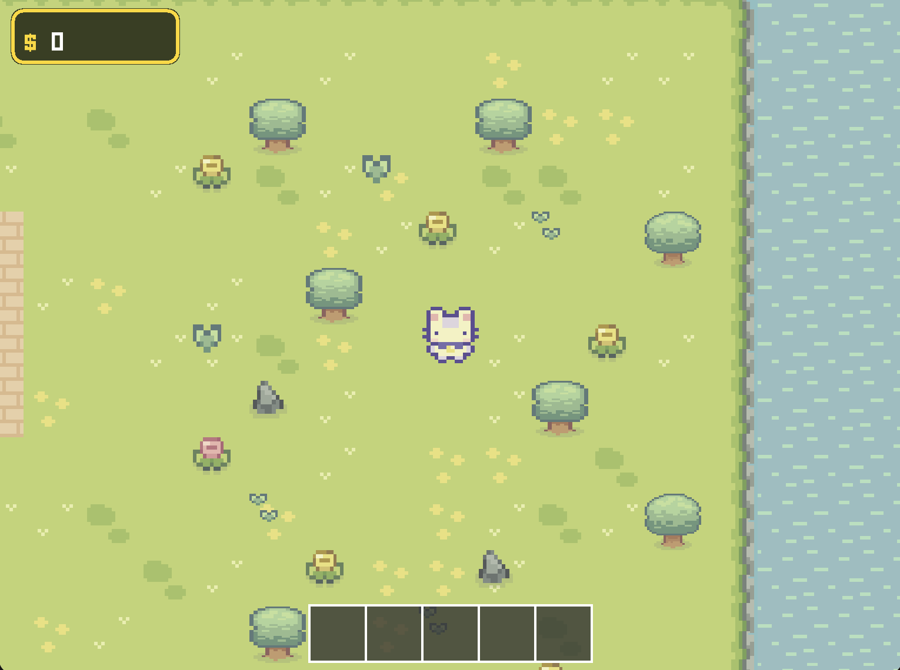
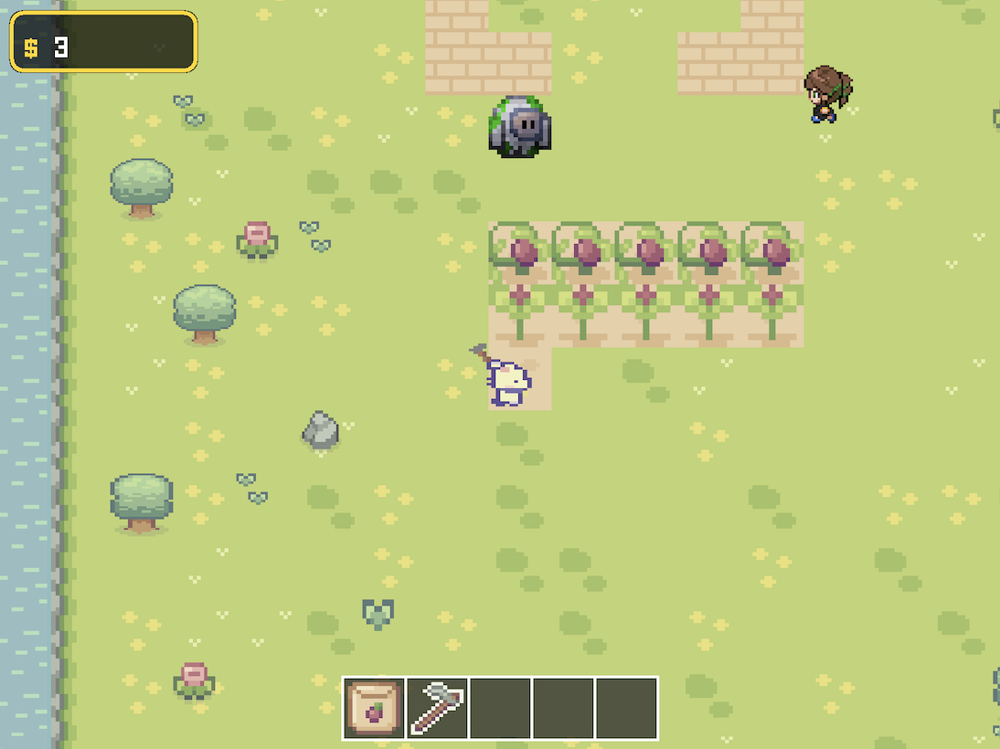
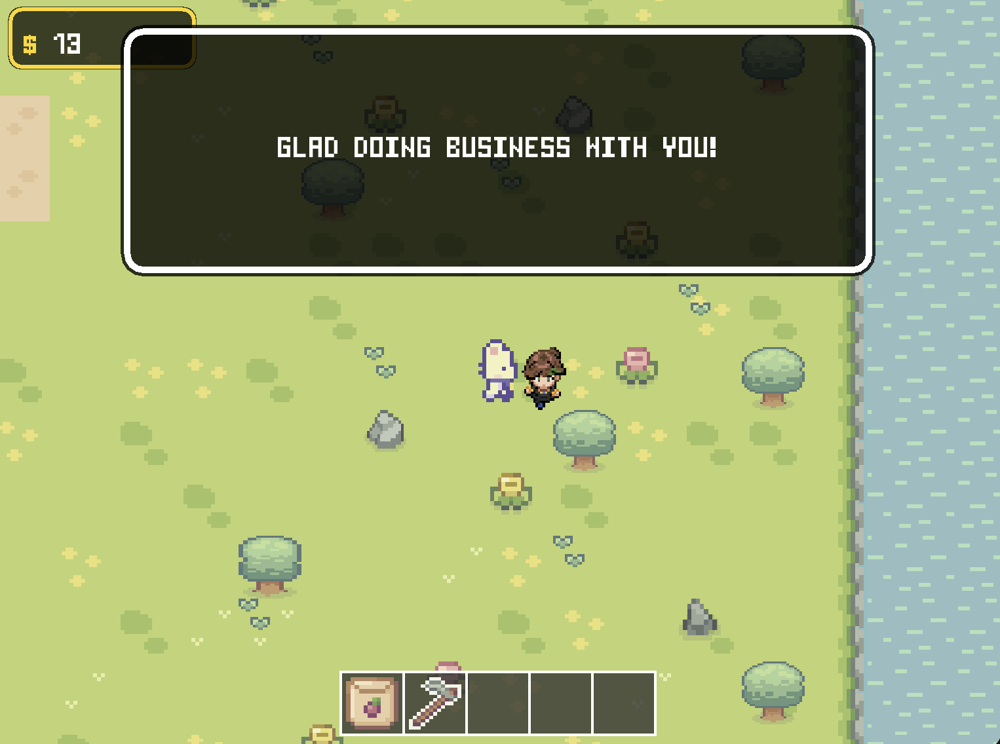
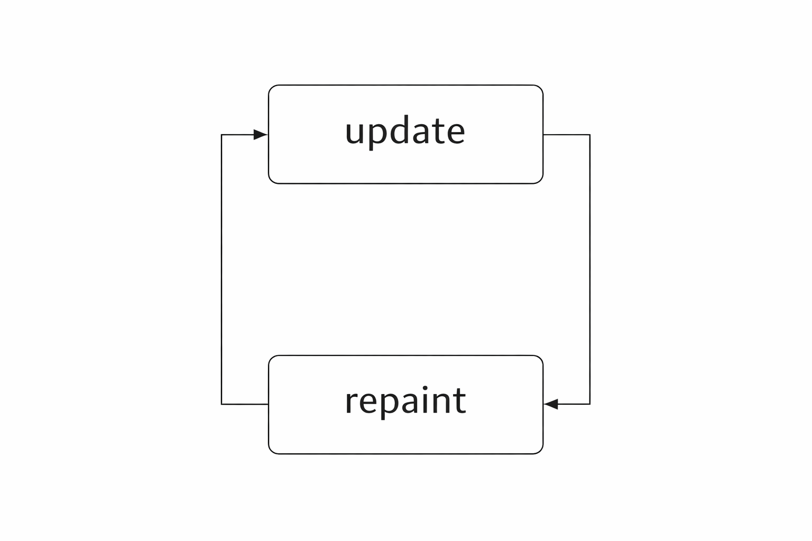

# 🌾 Whiskerfield

A 2D farming game built entirely in Java with zero external libraries.

---

## 📖 About

Whiskerfield is a simple farming simulation where you till the land, plant seeds, harvest crops, and sell your produce to make money. Explore your farm, chat with NPCs, and make bread $$.

---

## 📸 Screenshots






---

## 🚀 How to Run

### Prerequisites
- Java 17 or higher (JDK)

### Running the Game

1. Clone the repository:
   ```bash
   git clone https://github.com/ryou02/whiskerfield.git
   cd whiskerfield
   ```

2. Compile the source files:
   ```bash
   javac -d bin src/**/*.java
   ```

3. Run the game:
   ```bash
   java -cp bin:src main.Main
   ```
   > On Windows, use `bin;src` instead of `bin:src`

---

## ⚙️ How It Works

### The Game Loop
Whiskerfield runs on a dedicated game thread. When the game starts, `startGameThread()` is ran and creates a new thread that runs the following game loop: 

1. **Update Phase** — `update()` is called every frame to:
   - Update player position and animations based on keyboard input
   - Update all NPC movement and behavior
   - Update plant growth timers (plants grow through 3 stages over time)
   - Handle collision detection for all entities
2. **Render Phase** — `repaint()` triggers the rendering pipeline via `paintComponent()` to draw with the following with the updated information:
   - Tiles (background layer)
   - Objects (decorations, tools, seeds)
   - NPCs
   - Player (always on top)
   - UI elements (dialogue, menus, HUD)

The game thread targets 60 updates per second. Frame timing is controlled using `System.nanoTime()` and `Thread.sleep()` to keep the game running at a consistent speed and to avoid updating too quickly.



### Other Core Systems

**Tile-Based World**
- 50x50 tile world map loaded from a textfile(map01.txt). Each number represents a block (for an example 3 is a water block).
- Camera follows player and renders tiles only the player can see rather than the whole map(camera culling) to help optimize rendering. 
- Each tile has the properties type, collision, and image.

**Entity System**
- Each entity(NPCs and player) has position, speed, direction, collision box, and sprite animations.
- Collision detection uses bounding box intersection tests.

**States**
- Game states: Title, Play, Pause, Dialogue.
- State determines which systems update and what UI renders.
- Input handling changes based on current state.

**Plant Growth System**
- Plants stored in an ArrayList with growth stages (1-3).
- Each plant tracks a frame counter that increments every update.
- When counter reaches threshold (300 frames ≈ 5 seconds), plant advances to next stage.

**Technologies**
- Pure Java 21 with zero external libraries
- Java AWT/Swing for graphics and input handling (KeyListener), Java Sound API for audio, and ImageIO for asset loading..

---

## 🎮 Controls

| Key | Action |
|-----|--------|
| WASD | Move |
| E | Till soil |
| R | Plant seeds |
| T | Harvest crops |
| ESC | Pause menu(use arrow keys and enter to navigate) |

---

## 🎨 Sprite Credits

This game primarily uses art assets from Cup Nooble, with additional assets credited to their respective creators.
